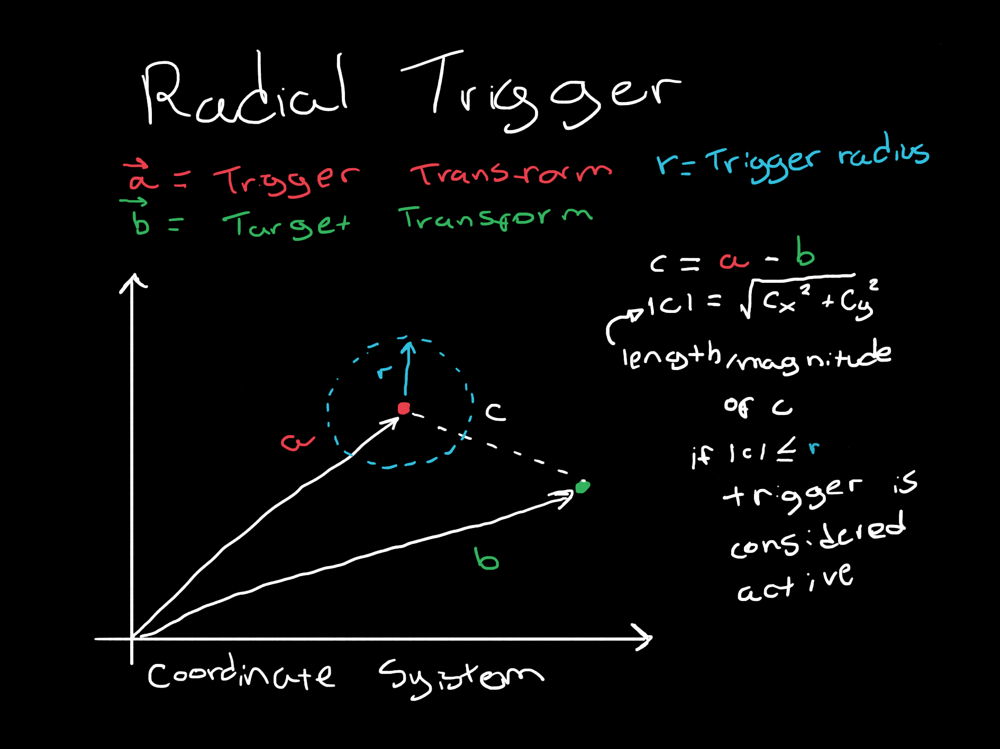

# Math For Game Development

This is a collection of simple examples for math applications in game development. The examples here are based on a [playlist of video lessons](https://youtube.com/playlist?list=PLImQaTpSAdsD88wprTConznD1OY1EfK_V) from [Freya Holmér](https://www.youtube.com/c/Acegikmo) on YouTube.

- [Math For Game Development](#math-for-game-development)
  - [Content](#content)
  - [Examples](#examples)
    - [Radial Trigger](#radial-trigger)
    - [Look-at trigger](#look-at-trigger)

## Content

The main subject of the examples is linear algebra. Here we will be talking about:
* Vectors
* Dot products
* Spaces

## Examples

In the simulation, tha player can move arround the game world with WASD and interact with the showcased applications of linear algebra. Next to each showcase, a panel explaining the mathematic behind it is shown, the explanations can also be found on this readme. The showcases are detailed below.

### Radial Trigger

A trigger that activates whenever the target object is within a certain radius. This techinque can be applied when you want to start a cutscene when a player approaches a certain object, or when you want a certain effect to be applied when the player enters an area. For example, in Valorant, Cypher's cage is a radial trigger that activates whenever an enemy player enters the effect area, triggering a sound allarm.

The way this trigger is calculates is by getting the difference between the vectors for the positions of the target and the trigger, the we calculate the magnitude of this vector defined by `|c| = sqrt(Σ ci²)`, where `c` is the difference vector, and `ci` is each entry of `c`. If the magnitude is smaller than the radius, the trigger is activated.

<p align="center" >
  
</p> 

The resulting C# code is shown below.

```csharp
bool CheckTrigger()
{
  Vector3 distanceVector = (transform.position - triggerTarget.transform.position);
  float distance = Mathf.Sqrt(Mathf.Pow(distanceVector.x, 2) + Mathf.Pow(distanceVector.y, 2) + Mathf.Pow(distanceVector.z, 2));
  // We calculate it manually for didactic reasons
  // However, unity has a built-in function for this
  // We could simply use "float distance = distanceVector.magnitude"
  return distance < radius;
}
```

### Look-at trigger

A trigger that activates when the target is facing it by a certain angle with a treshhold ranging from 0 to 1. This techinque is commonly used to apply effects os trigger actions when the player is looking at a certain object. A few exemples are any flash grenade in games like Valorant and CS:GO or the quantic objects in Outer Wilds that change their position when the player is not looking. Also, a lot of fighting games where you fight multiple enemies at once, like the Spider-Man 2018 of the Batman Arkham games, the enemies rarely attack the player if the camera is not looking at them.

We can achieve this behaviour by tracing two vectors: the unit vector that goes from the target to the trigger and the unit vector that represents the forward direction of the target. Then we can use the dot product to calculate the angle between the two vectors, or more precisely, the cosine of this angle. This is a number between -1 and 1, where -1 means the target is facing away from the trigger, 1 means the target is facing exactly the trigger and 0 means that the target's line of sight is perpendicular to the direction to the trigger. If the cosine is greater or equal to the treshhold, the trigger is activated. The dot product between two vectros `a` and `b` is defined by `a · b = Σ ai * bi`.

The corresponding C# code looks like this:

```csharp
bool CheckTrigger()
{
  Vector3 a = triggerTarget.transform.forward;
  Vector3 b = (transform.position - triggerTarget.transform.position).normalized;
  float cosAngle = a.x * b.x + a.y * b.y + a.z * b.z;
  // Much like the magnitude, here we calculate the dot product manually
  // Hut unity also provides a built-in function for this like so:
  // "float cosAngle = Vector3.Dot(triggerTarget.transform.forward, (a - b)"
  return cosAngle >= treshhold;
}
```

